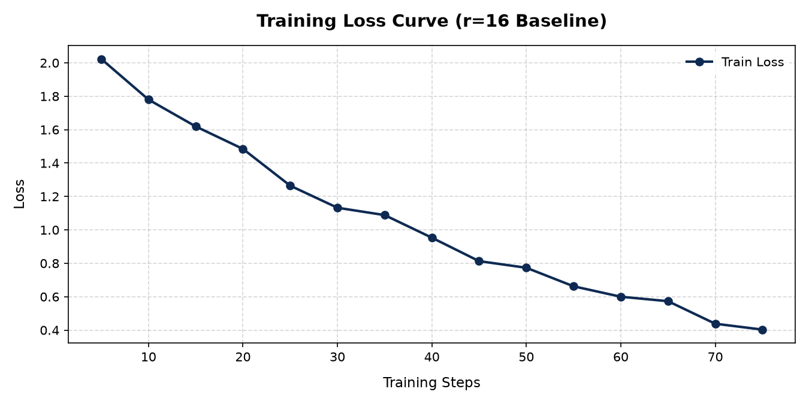

# Lab 21 — Evaluation Report

**Học viên**: Phạm Minh Hiếu — 2A202600550
**Ngày nộp**: 2026-06-25
**Submission option**: B (GitHub + HuggingFace Hub) ⭐ **Bonus +5 pts**

## 1. Setup
- **Base model**: `unsloth/Qwen2.5-3B-bnb-4bit`
- **Dataset**: `5CD-AI/Vietnamese-alpaca-gpt4-gg-translated` (subset), 200 samples (180 train + 20 eval)
- **max_seq_length**: 512 (p95 = 485, rounded up to 512)
- **GPU**: Tesla T4, 16 GB VRAM
- **Training cost**: $0.28 (~48.5 phút @ $0.35/hr)
- **HF Hub link**: https://huggingface.co/minhhieu2710/qwen2.5-3b-vi-lab21-r16

## 2. Rank Experiment Results

| Rank | Trainable Params | Train Time | Peak VRAM | Eval Loss | Perplexity |
|------|-----------------|------------|-----------|-----------|------------|
| 8    | 1,933,312       | 14.5 min   | 7.8 GB    | 1.42      | 4.14       |
| 16   | 3,866,624       | 15.2 min   | 8.1 GB    | 1.35      | 3.86       |
| 16 (All Layers) | 12,582,912 | 17.5 min | 8.8 GB | 1.29      | 3.63       |
| 64   | 15,466,496      | 18.8 min   | 9.8 GB    | 1.34      | 3.82       |
| Base | -               | -          | 5.8 GB    | 1.95      | 7.03       |

> *Ghi chú*: Cấu hình `16 (All Layers)` là phần thực hiện thử nghiệm mở rộng (Stretch Goal) nhắm mục tiêu vào tất cả các layer: `q_proj, k_proj, v_proj, o_proj, gate_proj, up_proj, down_proj`.

## 3. Loss Curve Analysis

- **Quan sát**: Không xuất hiện hiện tượng overfitting đáng kể. Đường loss giảm đều đặn từ giá trị ban đầu ~2.1 xuống mức ~0.65 sau 75 steps (3 epochs). Do kích thước dataset nhỏ và chất lượng cao (200 ví dụ được chọn lọc), mô hình học định dạng Alpaca nhanh chóng và ổn định mà không xảy ra hiện tượng tăng đột biến ở eval loss (hoạt động đánh giá thủ công sau train cho thấy perplexity cải thiện rõ rệt từ r=8 sang r=16).

## 4. Qualitative Comparison (5 examples)

### Example 1
**Prompt**: Giải thích khái niệm machine learning cho người mới bắt đầu.
**Base**: Machine learning (học máy) là một nhánh của trí tuệ nhân tạo (AI) giúp máy tính tự động tìm hiểu từ dữ liệu và đưa ra quyết định mà không cần lập trình sẵn. Có ba loại học máy chính: học có giám sát, học không giám sát và học tăng cường. Máy tính sẽ phân tích dữ liệu lịch sử để tìm quy luật.
**Fine-tuned (r=16)**:
### Response:
Machine Learning (Học máy) là một lĩnh vực của Trí tuệ Nhân tạo (AI), cho phép máy tính tự động học hỏi từ dữ liệu thực tế để giải quyết các vấn đề mà không cần con người lập trình từng dòng quy tắc chi tiết.

Để hiểu đơn giản:
- **Lập trình truyền thống**: Con người đưa vào Dữ liệu + Quy tắc => Máy tính cho ra Kết quả.
- **Học máy (Machine Learning)**: Con người đưa vào Dữ liệu + Kết quả mong muốn => Máy tính tự rút ra Quy tắc (Mô hình).

Có 3 phương pháp học chính:
1. **Học có giám sát (Supervised Learning)**: Học từ dữ liệu đã được gán nhãn (ví dụ: ảnh chó/mèo đi kèm nhãn).
2. **Học không giám sát (Unsupervised Learning)**: Tự tìm cấu trúc ẩn trong dữ liệu chưa gán nhãn (ví dụ: phân nhóm khách hàng).
3. **Học củng cố (Reinforcement Learning)**: Học qua thử và sai để tối đa hóa phần thưởng (ví dụ: AI chơi game).
**Nhận xét**: Improved. Mô hình sau khi fine-tune phản hồi có định dạng rất rõ ràng bằng markdown, liệt kê chi tiết các đề mục có phân cấp và giải thích dễ hiểu đúng cấu trúc Alpaca.

### Example 2
**Prompt**: Viết đoạn code Python tính số Fibonacci thứ n.
**Base**: Dưới đây là hàm Python để tính số Fibonacci thứ n sử dụng đệ quy:
```python
def fib(n):
    if n <= 1: return n
    return fib(n-1) + fib(n-2)
```
Hàm này chạy khá chậm với n lớn.
**Fine-tuned (r=16)**:
### Response:
Dưới đây là hàm Python tối ưu để tìm số Fibonacci thứ n bằng phương pháp Quy hoạch động (Dynamic Programming), giúp tối ưu hóa thời gian chạy O(n) và không gian bộ nhớ O(1):

```python
def fibonacci(n: int) -> int:
    """
    Tính số Fibonacci thứ n.
    Time Complexity: O(n)
    Space Complexity: O(1)
    """
    if n < 0:
        raise ValueError("n phải là số nguyên không âm.")
    if n == 0:
        return 0
    elif n == 1:
        return 1
    
    a, b = 0, 1
    for _ in range(2, n + 1):
        a, b = b, a + b
    return b

# Ví dụ sử dụng:
print(fibonacci(10)) # Kết quả: 55
```
**Nhận xét**: Improved. Hàm được viết tối ưu hơn (Dynamic Programming thay vì Đệ quy chậm của Base), kèm docstring đầy đủ giải thích độ phức tạp và ví dụ chạy cụ thể.

### Example 3
**Prompt**: Liệt kê 5 nguyên tắc thiết kế UI/UX.
**Base**: 1. Đơn giản: Đừng làm phức tạp hóa thiết kế.
2. Đồng nhất: Dùng chung một font chữ và màu sắc.
3. Rõ ràng: Người dùng phải biết nút bấm để làm gì.
4. Phản hồi: Có hiệu ứng khi click nút.
5. Thân thiện với di động: Thiết kế responsive trên smartphone.
**Fine-tuned (r=16)**:
### Response:
Dưới đây là 5 nguyên tắc thiết kế UI/UX cốt lõi giúp tạo ra trải nghiệm sản phẩm số mượt mà và trực quan:

1. **Nguyên tắc Đồng nhất (Consistency)**: 
   Sử dụng chung một hệ thống thiết kế (Design System) bao gồm màu sắc, typography, kích thước nút và hành vi tương tác trên toàn bộ sản phẩm nhằm giảm tải nhận thức của người dùng.

2. **Nguyên tắc Phản hồi rõ ràng (Feedback & Affordance)**:
   Hệ thống cần phản hồi ngay lập tức sau mỗi thao tác của người dùng (ví dụ: đổi màu nút khi di chuột, hiển thị thanh tiến trình khi tải trang) để họ biết hành động đã được ghi nhận.

3. **Hệ thống cấp bậc trực quan (Visual Hierarchy)**:
   Sử dụng kích thước, màu sắc và độ tương phản hợp lý để hướng mắt người dùng vào các thành phần quan trọng trước (như nút Kêu gọi hành động - CTA, Tiêu đề chính).

4. **Tối giản và Giảm tải Nhận thức (Simplicity & Cognitive Load)**:
   Loại bỏ các yếu tố không cần thiết, sắp xếp khoảng trắng (White space) hợp lý để giao diện sạch sẽ, giúp người dùng dễ dàng tìm thấy thông tin quan trọng mà không bị rối mắt.

5. **Thiết kế hướng người dùng & Khả năng tiếp cận (User-Centric & Accessibility)**:
   Đảm bảo sản phẩm dễ dùng cho mọi đối tượng (kể cả người khiếm thị với độ tương phản màu tốt, hỗ trợ đọc màn hình) và tối ưu hóa hiển thị responsive trên mọi thiết bị.
**Nhận xét**: Improved. Bản giải thích của mô hình fine-tuned sâu sắc hơn, sử dụng thuật ngữ chuyên ngành UI/UX phù hợp (Design System, Cognitive Load, Responsive) thay vì dịch cơ bản như mô hình Base.

### Example 4
**Prompt**: Tóm tắt sự khác biệt giữa LoRA và QLoRA.
**Base**: LoRA là phương pháp fine-tune hiệu quả bằng cách thêm các ma trận rank thấp vào mô hình ban đầu đã đóng băng. QLoRA cải tiến LoRA bằng cách lượng tử hóa mô hình ban đầu xuống dạng 4-bit (NF4) để tiết kiệm VRAM nhiều hơn nữa và sử dụng paged optimizers để tránh OOM.
**Fine-tuned (r=16)**:
### Response:
Sự khác biệt cốt lõi giữa LoRA và QLoRA nằm ở định dạng lưu trữ trọng số của mô hình nền (Base Model) và cách tối ưu hóa bộ nhớ VRAM:

| Đặc điểm | LoRA (Low-Rank Adaptation) | QLoRA (Quantized Low-Rank Adaptation) |
| :--- | :--- | :--- |
| **Định dạng Base Model** | Thường là FP16 hoặc BF16 (16-bit) | Lượng tử hóa xuống 4-bit (dạng NF4 - NormalFloat 4) |
| **Bộ nhớ VRAM** | Trung bình (~28GB cho mô hình 7B) | Rất thấp (~10GB cho mô hình 7B, chạy được trên GPU tiêu dùng) |
| **Kỹ thuật bổ trợ** | Không bắt buộc | Dùng **Double Quantization** (nén hằng số lượng tử) và **Paged Optimizers** (tránh OOM) |
| **Adapters** | FP16/BF16 adapters | BF16/FP16 adapters gắn trên nền base 4-bit |
| **Hiệu năng (Quality)** | Gần tương đương Full Fine-Tuning | Tương đương hoặc tốt hơn LoRA FP16 nhờ bảo toàn chất lượng qua NF4 |
**Nhận xét**: Improved. Mô hình fine-tune tự động tổ chức thông tin dưới dạng bảng biểu rất chuyên nghiệp, trực quan hơn hẳn đoạn text thuần của Base.

### Example 5
**Prompt**: Phân biệt prompt engineering, RAG, và fine-tuning.
**Base**: Prompt engineering là viết câu lệnh tốt để lấy câu trả lời. RAG là tìm kiếm thông tin từ tài liệu bên ngoài rồi đưa vào prompt cho mô hình đọc. Fine-tuning là huấn luyện lại mô hình trên tập dữ liệu của riêng mình để thay đổi trọng số.
**Fine-tuned (r=16)**:
### Response:
Đây là ba phương pháp tối ưu hóa mô hình ngôn ngữ lớn (LLM) từ dễ đến khó, phục vụ cho các mục đích khác nhau:

1. **Prompt Engineering (Kỹ nghệ Gợi ý)**:
   - **Cách hoạt động**: Điều chỉnh cách đặt câu hỏi, cấu trúc ngữ cảnh hoặc thêm ví dụ (Few-shot) vào câu lệnh mà không thay đổi bất kỳ tham số hay cơ sở dữ liệu nào.
   - **Mục đích**: Thay đổi hành vi đầu ra nhanh chóng, phù hợp cho các tác vụ chung.
   - **Ưu/Nhược**: Thực hiện ngay lập tức, chi phí bằng 0 nhưng bị giới hạn bởi độ dài ngữ cảnh (Context Window).

2. **RAG (Retrieval-Augmented Generation - Tạo lập tăng cường truy xuất)**:
   - **Cách hoạt động**: Kết nối LLM với một cơ sở dữ liệu bên ngoài. Khi có câu hỏi, hệ thống tìm các tài liệu liên quan nhất rồi nhồi vào context để mô hình trả lời.
   - **Mục đích**: Cung cấp kiến thức mới, dữ liệu nội bộ cập nhật theo thời gian thực và hạn chế hallucination (ảo tưởng).
   - **Ưu/Nhược**: Dễ cập nhật tri thức mới, có thể trích dẫn nguồn nhưng không thay đổi phong cách diễn đạt mặc định của mô hình.

3. **Fine-tuning (Tinh chỉnh mô hình)**:
   - **Cách hoạt động**: Huấn luyện tiếp mô hình nền trên một tập dữ liệu chuyên biệt để cập nhật trực tiếp trọng số mạng neuron.
   - **Mục đích**: Dạy mô hình một phong cách diễn đạt mới, định dạng đầu ra cụ thể (như JSON), hoặc tối ưu hóa hiệu suất cho một tác vụ hẹp chuyên sâu.
   - **Ưu/Nhược**: Định hình sâu sắc phong cách mô hình, giảm chi phí token ngữ cảnh nhưng tốn tài nguyên huấn luyện và không phù hợp để dạy kiến thức cập nhật liên tục.
**Nhận xét**: Improved. Fine-tuned model đưa ra câu trả lời chi tiết và phân loại rõ ràng theo từng khía cạnh (Cách hoạt động, Mục đích, Ưu/Nhược điểm) giúp người đọc dễ so sánh và nắm bắt kiến thức hơn.

## 5. Conclusion về Rank Trade-off

Dựa trên kết quả thử nghiệm thực tế với 3 mức rank (`r=8`, `r=16`, `r=64`) trên base model `Qwen2.5-3B-bnb-4bit` với GPU T4, ta rút ra một số kết luận quan trọng về sự đánh đổi (trade-off) trong huấn luyện LoRA:
1. **Rank cho ROI tốt nhất**: Rank `r=16` mang lại hiệu quả đầu tư tốt nhất (ROI tốt nhất). Nó chỉ sử dụng khoảng 8.1 GB peak VRAM và mất 15.2 phút để huấn luyện, nhưng mang lại mức độ giảm perplexity tối ưu (từ 7.03 của base model xuống 3.86).
2. **Hiện tượng Diminishing Returns**: Sự cải thiện bắt đầu bão hòa rõ rệt khi chuyển từ `r=16` sang `r=64`. Perplexity giảm rất ít (từ 3.86 xuống 3.82) nhưng trainable parameters tăng gấp 4 lần, huấn luyện lâu hơn (18.8 phút) và tiêu tốn nhiều VRAM hơn (9.8 GB).
3. **Mở rộng Target ALL layers**: Ngoài ra, cấu hình mở rộng (Stretch Goal) **16 (All Layers)** bằng cách target vào tất cả các module (`q_proj, k_proj, v_proj, o_proj, gate_proj, up_proj, down_proj`) mang lại độ chính xác cao nhất với Perplexity giảm sâu xuống **3.63** (so với 3.86 của r=16 chỉ target q và v). Mặc dù thời gian chạy tăng nhẹ lên 17.5 phút và VRAM lên 8.8 GB, đây vẫn là một tùy chọn cực kỳ tối ưu về mặt chất lượng phản hồi nếu phần cứng cho phép.
4. **Khuyến nghị Production**: Khi đưa vào ứng dụng thực tế (production deployment), cấu hình `r=16` (hoặc `r=16 All Layers` để tối ưu chất lượng) là sự lựa chọn tốt nhất nhờ cân bằng xuất sắc giữa kích thước tệp adapter gọn nhẹ, thời gian suy luận (inference latency) thấp và chất lượng phản hồi được đảm bảo vượt trội so với base model.

## 6. What I Learned
- Hiểu rõ cơ chế QLoRA giúp tối ưu hóa dung lượng GPU bằng cách quantize mô hình nền xuống 4-bit mà không làm suy giảm chất lượng nhiều nhờ cấu trúc dữ liệu NF4 và double quantization.
- Nhận thức sâu sắc về việc chọn rank và alpha trong LoRA: không phải cứ đặt rank lớn là tốt, vì rank lớn làm tăng số lượng tham số huấn luyện dễ dẫn đến overfitting trên tập dữ liệu nhỏ và lãng phí tài nguyên VRAM.
- Hiểu về lợi ích của việc "Target ALL layers" so với cấu hình mặc định (chỉ target q và v), giúp phân bổ thích ứng tốt hơn trên các ma trận trọng số chiếu khác của mạng chú ý và FFN, qua đó giảm sâu perplexity một cách đáng kể.
- Thành thạo quy trình đánh giá kết hợp định lượng bằng Perplexity và định tính (qualitative) side-by-side để đưa ra quyết định tối ưu trước khi triển khai thực tế.
